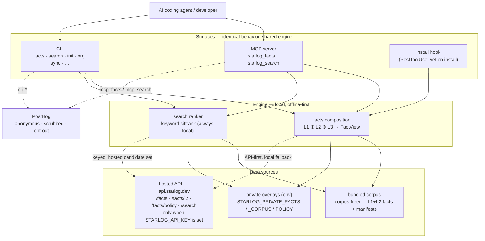
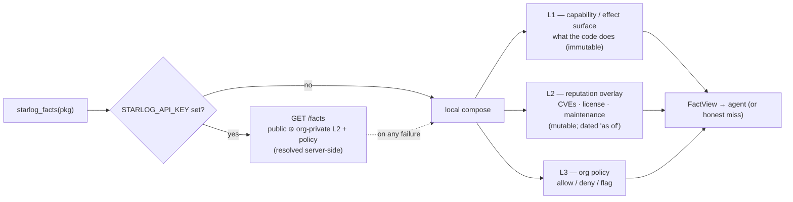
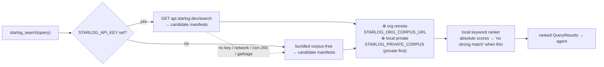
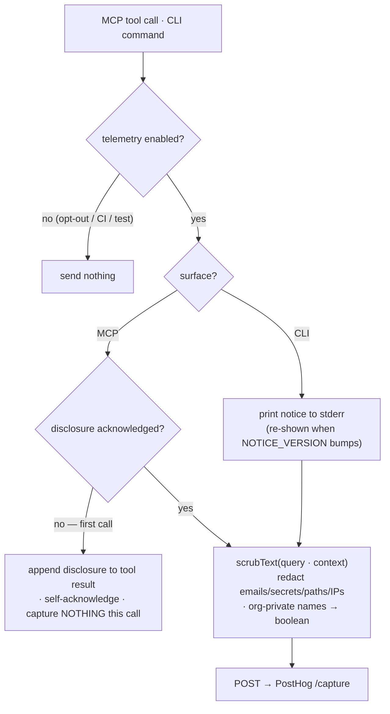

# Architecture

How Starlog is put together: the surfaces an agent touches, the offline-first
engine behind them, where data comes from, and what (if anything) leaves the
machine. Diagrams are [Mermaid](https://mermaid.js.org/) — they render on GitHub.

For the on-the-wire facts shape see [FACTS-CONTRACT.md](FACTS-CONTRACT.md); for
the privacy details of telemetry see the [Telemetry](../README.md#telemetry)
section of the README.

## System overview

Three **surfaces** (MCP server, CLI, install hook) all call **one shared engine**,
so they behave identically. The engine is local and offline-first; a hosted API
(`api.starlog.dev`) is an *optional* upgrade gated on `STARLOG_API_KEY`, and a
hosted failure always degrades to local. Anonymous, scrubbed, opt-out usage
telemetry is the only thing that ever leaves the machine.

## Facts — three independent layers, composed at query time

`starlog_facts(pkg)` never collapses into one blurry score. It composes three
layers that are sourced and resolved independently. When a key is set the resolve
is **API-first** (the server returns public ⊕ org-private L2 + policy, already
resolved); with no key — or on any API error — it composes from the local corpus
plus your env overlays. See `src/engine/facts/service.ts` (`resolveFactView`,
`buildComposeDeps`) and `compose.ts`.

Org overlays merge **per layer, private-wins** — except `known_vulns`, which is
*unioned with the public base winning on a duplicate id*, so a private overlay can
never silently suppress an upstream vulnerability (`l2-source.ts`, `mergeOverlay`).

## Search — local ranking, optionally a hosted candidate set

`starlog_search(query)` is a separate discovery surface. The bundled package ships
only the small `corpus-free` tier; with `STARLOG_API_KEY` set the **candidate set**
is fetched from the hosted full corpus, then ranked by the **same local engine** —
so a key widens *what* can be found, never *how* it's scored. Any hosted failure
falls back to the bundled corpus (`src/search-service.ts` → `engine/hosted-corpus.ts`).
With `STARLOG_ORG_CORPUS_URL` set, a company-hosted `{ manifests }` JSON layer is
fetched every run and merged between the base corpus and the per-machine private
overlay (`engine/org-corpus.ts`).

## Telemetry & consent

The only thing that leaves the machine. One choke point (`src/telemetry.ts`,
`track()`); MCP event shapes are built in `mcp-telemetry.ts`. It is anonymous
(a random id, no account), default-off in CI/tests, and opt-out via
`STARLOG_TELEMETRY=0`, `DO_NOT_TRACK=1`, `starlog telemetry disable`, or
`--no-telemetry`.

What's captured: the command/tool, version/OS, result counts, the **public**
package names looked up, and search queries / project context — with emails,
secrets, absolute paths, and IPs **scrubbed before send** (`scrubText`).
**Org-private** package names (from a private overlay) are never sent — redacted
to a boolean.

Consent is surfaced on the channel each surface can actually reach a human on. The
CLI prints the notice to stderr (re-shown when `NOTICE_VERSION` bumps). The MCP
server can't show a human a notice directly, so on an unacknowledged install it
**appends a one-line disclosure to its first tool result** (which the agent
relays), captures nothing on that call, self-acknowledges, and records from the
next call — nothing is ever collected before the human has been shown what's
collected.

